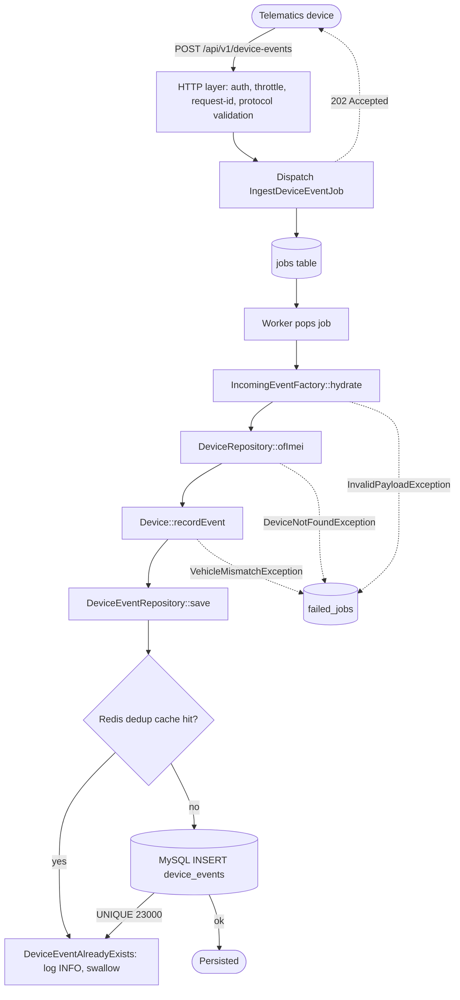
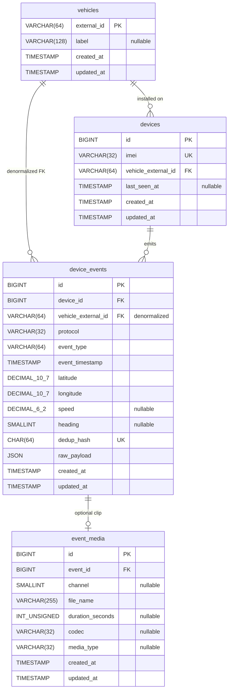

# Device Event Ingestion service

Telematics/video event ingestion service built in Laravel.
The service ingests event data from CV200/Howen devices, normalizes, and stores it in a database.
The service exposes a searchable event API that supports filtering by various properties.

## Tech stack
- PHP 8.5
- Laravel 12
- MySQL
- Redis
- Docker Compose

---

## Quick start
**Prerequisites:** Docker Engine + Docker Compose v2.

```bash
cp .env.example .env
docker compose build
docker compose run --rm app composer install            # populates the vendor volume
docker compose run --rm -u 0 app php artisan key:generate  # writes APP_KEY into .env (needs root to touch the host file)
docker compose up -d                                    # starts mysql + redis + app + nginx + worker
docker compose exec app php artisan migrate
docker compose exec app php artisan ingestion:seed-fleet
# Service is now on http://localhost:8000
# Swagger UI: http://localhost:8000/docs
# Health:    http://localhost:8000/healthz
```

Try the sample payloads:

```bash
./examples/curl-examples.sh
```

Run the test suite (inside the container — `vendor/` lives in a Docker volume):

```bash
docker compose exec app vendor/bin/phpunit
```

Logs live in the `storage-data` volume rather than on the host. Tail them with:

```bash
docker compose logs -f app worker
# or, for the Laravel file log specifically:
docker compose exec app tail -f storage/logs/laravel.log
```

---

# Implementation details

Opinionated DDD layout for separation of concerns and extendability.

Assumptions made:
- Device & vehicle creation is outside the scope of the task
- All inbound timestamps are UTC.
- IMEI is a 14–17 digit unique per-device numeric string (matches the GSM standard plus check digit).
- Each event has at most one media file. The schema generalizes to many; the current normalizers only expose one.
- Devices don't care about processing outcomes; error handling is out of the HTTP contract.
- Howen alarm codes can grow beyond the few listed in the assignment.
- Vehicle plate number is unique and used as the PK of the `vehicles` table.

Trade-offs made:
- DDD layout: overkill for two protocols, but makes "where do I put protocol #3?" obvious. Service fights against Laravel which causes friction.
- A single static API key is used for auth; a real credential provider can be plugged in later.
- Rate limiting reaches into the request body for `imei`/`device_imei`, so new protocols may need their IMEI field plumbed in.
- Database was used for queue backend. While redis-based one was evaluated, database approach was selected as the "good enough" approach for the task.
- Device event filtering (`from`/`to`) accepts `YYYY-MM-DD` only, interpreted as UTC, with both bounds inclusive.
- Domain layer model handling is a bit awkward (e.g. created vs persisted DeviceEvent entity), but further effort was skipped to not over-engineer the solution too much.

## Architecture overview

Layered DDD-flavored layout. The aim is clean seams for adding a protocol or swapping infrastructure, not full DDD machinery.

### Codebase layout

Everything under `app/` is namespaced `DeviceEventIngestionService\` (mapped in `composer.json`). Four layers, with a strict outside-in dependency rule: `Ui` → `Application` → `Domain` ← `Infrastructure`. The Domain layer never imports framework code.

```
app/
├── Domain/              ← pure PHP, no Laravel imports
│   ├── Device/          ← Device aggregate + DeviceImei VO + repo interface
│   ├── DeviceEvent/     ← IncomingEvent, DeviceEvent, factories, repo interface,
│   │   ├── Factory/         ← one folder per protocol (CV200/, Howen/)
│   │   ├── Queries/         ← VehicleEventQuery (read-side criteria)
│   │   ├── ValueObject/     ← DedupHash, EventTimestamp, EventType, GeoPoint, Media
│   │   └── Exception/       ← InvalidPayloadException, DeviceEventAlreadyExists, …
│   └── Vehicle/         ← VehicleId VO
│
├── Application/         ← use cases; pure orchestration
│   └── Services/
│       ├── DeviceEventIngestion/   ← write side: Service + Command DTO
│       └── ListVehicleEvents/      ← read side:  Service + Query DTO
│
├── Infrastructure/      ← Eloquent + framework adapters
│   ├── Model/Device/        ← EloquentDeviceModel + repository implementation
│   ├── Model/Event/         ← EloquentDeviceEventModel + repository + Caching decorator
│   ├── Model/Vehicle/       ← EloquentVehicleModel (label registry)
│   └── Validation/          ← Laravel adapter for the IncomingEventPayloadValidator port
│
├── Providers/           ← container bindings, one provider per concern
└── Ui/                  ← entry points
    ├── Http/
    │   ├── Controllers/Api/V1/  ← thin __invoke controllers
    │   ├── Middleware/          ← ApiKeyAuth, AssignRequestId, BindRequestContextToLogger
    │   ├── Requests/            ← FormRequests (top-level shape only)
    │   └── Resources/           ← DeviceEventResource (JSON serialisation)
    └── Queue/                   ← IngestDeviceEventJob
```

### Event ingestion request flow (async-only)

The HTTP layer only validates the top-level `protocol`, dispatches the job, and returns **202 Accepted**. Normalisation, domain validation, and DB writes happen in the worker. Domain failures land in `failed_jobs`.



**Error mapping** (worker side, all exceptions caught by Laravel's queue machinery):

- `DeviceEventAlreadyExists` → logged INFO, swallowed (expected dedup outcome).
- `DeviceNotFoundException`, `VehicleMismatchException`, `InvalidPayloadException` → job failure → `failed_jobs`.
- Any other `Throwable` → logged ERROR + re-thrown for retry/failure.

## Database structure



## Redis usage

Redis is used in two places in the service:
- **Rate limiting**: The ingestion endpoint
- **Deduplication**: A DeviceEvent repository decorator that leverages Redis with DeviceEvent provided deduplication keys.

# Addressing other assignment notes

## Making this production-ready

Things to consider before production, given the current assignment's requirements and provided context:
- **Cursor pagination on the read API.** `GET /vehicles/{id}/events` uses offset pagination (`?page=N`, `?limit=N`). At fleet scale the per-request `COUNT(*)` and offset-skip-under-concurrent-inserts both bite.
- **Dead-letter queue.** Failed jobs should surface somewhere visible (Sentry, a dashboard) instead of only the `failed_jobs` table.
- **Per-tenant API keys + audit log.** The static-key middleware is a demonstrator; production would likely needs scoped keys, rotation, and per-key request logs.
- **OpenAPI as the source of truth.** The spec is hand-written and may drift. Auto-generation is the preferable approach.
- **App layer.** Stateless PHP containers behind a load balancer (`php-fpm` + nginx); Octane for persistent workers and 5–10x request throughput.
- **Ingestion volume.** The HTTP path is async, so the bottleneck is worker concurrency × MySQL write throughput. Levers:
  1. Scale workers horizontally
  2. Batch inserts - group N events per transaction.
  3. Partition the queue by IMEI hash so a hot device doesn't starve others.
- **MySQL.** Partition `device_events` by timestamps (e.g. monthly) for cheap `DROP PARTITION` retention and smaller per-partition indexes. Read replica for the query API.
- **Observability.** Request-id middleware already tags every log line. Adding telemetry and dashboards for ingestion lag / dedup hit ratio / per-protocol error rates.
- **Docker setup.** Hardening of the Docker setup. For the sake of this assignment, a "good enough" approach was taken.

## Bonus points

Mapping of the assignment's nine optional improvements:

- **Queue-based processing.** HTTP is async-only: controller validates `protocol`, dispatches `IngestDeviceEventJob`, returns `202`. Worker handles normalisation, validation, Device aggregate, and persistence.

- **Docker setup.** `docker-compose.yml` runs **app** (php-fpm), **nginx**, **worker** (`php artisan queue:work database`), **mysql**, **redis**. `Makefile` wraps the common compose invocations.

- **Retry handling.** `IngestDeviceEventJob` sets `$tries = 3` and `$backoff = 5`.

- **Rate limiting.** `ingestion.throttle` middleware (`app/Ui/Http/Middleware/ThrottleIngestion.php`) keys on IMEI from the request body, so a noisy device can't starve others. Per-minute ceiling configurable via `config/ingestion.php → rate_limit.per_minute` (default 120). Redis-backed.

- **Event-driven architecture.** HTTP treats events as messages on an internal bus: controller enqueues, worker processes. No domain-event publishing — out of scope for current requirements.

- **Swagger/OpenAPI documentation.** `docs/openapi.yaml` describes both endpoints with schemas and example payloads. Rendered as Swagger UI at `/docs`, raw spec at `/docs/openapi.yaml`. Hand-written today; auto-generation noted above.

- **Metrics/logging.** `AssignRequestId` tags each request with a UUID (or honours an inbound `X-Request-Id`); `BindRequestContextToLogger` attaches `request_id`, `method`, `path`, `protocol`, `imei` to every log line via Monolog processors. Default `json` log channel.

- **Authentication.** `ApiKeyAuth` middleware (`app/Ui/Http/Middleware/ApiKeyAuth.php`) validates `X-Api-Key` (or `Authorization: Bearer …`) against `config('ingestion.api_key')`.

- **Media file handling abstraction.** Media has its own table (`event_media` → `device_events`), VO (`Domain/DeviceEvent/ValueObject/Media`), Eloquent adapter (`EloquentDeviceEventMediaModel`), and factory state (`DeviceEventFactory::withMedia()`). Each protocol factory maps its own shape (CV200's `camera`, Howen's `video`) to the same `Media` VO. Schema is 1:N.

